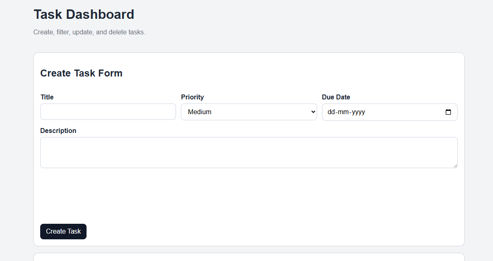

# Task Management App

A full-stack task management application built with React and Node.js. Create tasks with due dates, organize by priority, and track progress through status transitions.



## Features

- **Task CRUD operations** — Create, read, update, and delete tasks
- **Status workflow** — Tasks flow through open → in-progress → done states
- **Priority levels** — Assign low, medium, or high priority with color coding
- **Due date tracking** — Set due dates and get highlighted warnings for overdue tasks
- **Filtering** — View tasks by status and priority
- **Summary dashboard** — Quick overview of task distribution

## Tech Stack

- **Backend**: Node.js, Express, SQLite, Joi validation
- **Frontend**: React 19, Vite, Axios
- **Testing**: Jest, Supertest

## Getting Started

### Backend

```bash
cd backend
npm install
npm run dev
```

The server runs on `http://localhost:5000`.

### Frontend

```bash
cd frontend
npm install
npm run dev
```

The app runs on `http://localhost:5173`.

## API Endpoints

### Create Task
**POST** `/tasks`

```json
{
  "title": "Assignment",
  "description": "Finish project",
  "priority": "high",
  "dueDate": "2026-06-15"
}
```

Returns the created task with an auto-generated ID.

### List Tasks
**GET** `/tasks`

Supports filtering:
- `?status=open` or `in-progress` or `done`
- `?priority=high` or `medium` or `low`
- `?status=open&priority=high` (combine filters)

### Update Task Status
**PATCH** `/tasks/:id`

```json
{
  "status": "in-progress"
}
```

Status transitions are enforced: `open` → `in-progress` → `done`. Invalid transitions are rejected.

### Delete Task
**DELETE** `/tasks/:id`

### Get Summary
**GET** `/tasks/summary`

Returns task counts by status and priority:

```json
{
  "statusCounts": {
    "open": 2,
    "in-progress": 3,
    "done": 1
  },
  "priorityCounts": {
    "high": 2,
    "medium": 2,
    "low": 2
  }
}
```

## Design Decisions

**SQLite for persistence** — No external database setup required. Works out of the box for local development and evaluation.

**ID generation with crypto.randomUUID()** — Uses Node's built-in API instead of adding a dependency.

**Status transitions** — Enforced at the API level to prevent invalid workflows (e.g., jumping directly from open to done).

**Client-side date validation** — The date picker blocks past dates, and the submit handler validates format before sending to the API.

**Summary button filtering** — The "Open" view shows both open and in-progress tasks for convenience, while other views show exact matches.

## Architecture

### Backend
- `backend/server.js` — Express setup and middleware
- `backend/routes/tasks.js` — All endpoints and business logic
- `backend/db.js` — SQLite schema and connection
- `backend/middleware/errorHandler.js` — Consistent error responses

### Frontend
- `frontend/src/components/Dashboard.jsx` — Main component managing task state and status filtering
- `frontend/src/components/TaskForm.jsx` — Form with date picker and validation
- `frontend/src/components/TaskList.jsx` — Renders filtered tasks
- `frontend/src/components/TaskCard.jsx` — Individual task with actions
- `frontend/src/components/Summary.jsx` — Status buttons and counts
- `frontend/src/components/Filters.jsx` — Status and priority dropdowns

## Database

Task records are stored in `backend/tasks.db` (SQLite binary file).

The `tasks` table has these columns:
- `id` (TEXT, primary key)
- `title` (TEXT)
- `description` (TEXT)
- `priority` (TEXT: low, medium, high)
- `status` (TEXT: open, in-progress, done)
- `dueDate` (TEXT: YYYY-MM-DD format)
- `createdAt` (TEXT: ISO timestamp)

## Future Improvements

- Authentication and multi-user support
- Drag-and-drop Kanban board view
- Pagination for large task lists
- Docker support
- Full test coverage across all endpoints
- Task search and advanced filtering

## Known Limitations

- Single-user application (no authentication)
- No persistent filters between sessions
- Basic CSS styling
